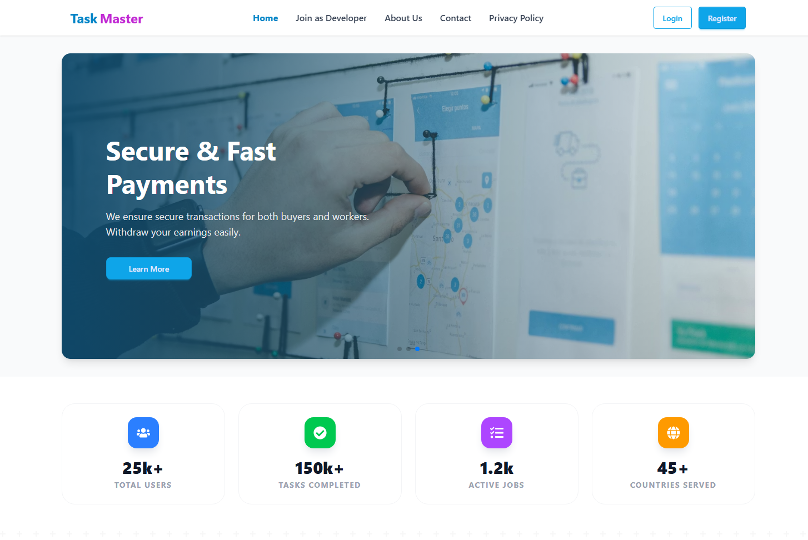
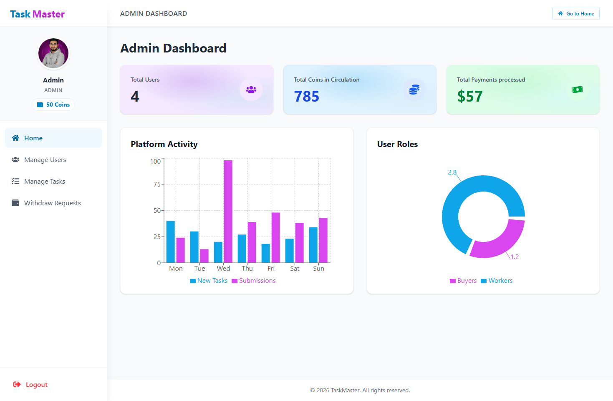
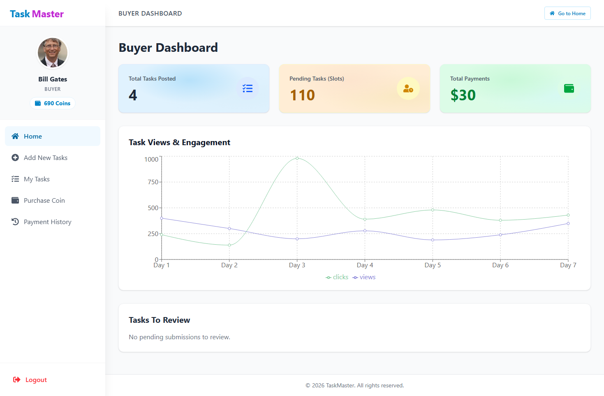

# Micro-Task Platform - Client

The Micro-Task Platform allows users to earn money by completing tasks, while
Buyers can create and manage tasks efficiently. Admins oversee the platform,
ensuring tasks, users, and payments are handled properly.

## Screenshots

|                              Home Page                               |                           Admin Dashboard                            |
| :------------------------------------------------------------------: | :------------------------------------------------------------------: |
|          |  |
|                           Buyer Dashboard                            |
|                                :---:                                 |
|  |

## Live Links

- **Live Client:** https://task-master-volt.vercel.app
- **Live Server API:** https://task-master-server-v1.vercel.app
- **Server Repository:**
  https://github.com/ashikurahman1/micro-task-platform-server

> ⚠️ Note: This repository contains the **client-side** code only.  
> The backend server is deployed separately and connected via environment
> variables.

## Tech Stack

- **React 18** - UI library
- **Vite** - Build tool and dev server
- **React Router v6** - Client-side routing
- **Tailwind CSS** - Utility-first CSS framework
- **Firebase Auth** - Authentication
- **Axios** - HTTP client
- **Stripe** - Payment processing
- **Swiper** - Modern slider library
- **React Icons** - Icon library
- **React Hot Toast** - Toast notifications

## Project Structure

```
src/
├── components/
│   ├── shared/          # Navbar, Footer
│   ├── home/            # Homepage sections
│   └── dashboard/       # Dashboard components
├── pages/
│   ├── dashboard/
│   │   ├── buyer/       # Buyer dashboard pages
│   │   ├── worker/      # Worker dashboard pages
│   │   └── admin/       # Admin dashboard pages
│   ├── Home.jsx
│   ├── Login.jsx
│   └── Register.jsx
├── contexts/            # React contexts (Auth)
├── hooks/               # Custom hooks
├── utils/               # Helper functions
└── routes/              # Route configurations
```

## Getting Started

### Prerequisites

- Node.js 18+ and npm

### Installation

1. Install dependencies:

```bash
npm install
```

2. Create `.env.local` file:

```bash
cp .env.example .env.local
```

3. Add your environment variables to `.env.local`

4. Start development server:

```bash
npm run dev
```

## Available Scripts

- `npm run dev` - Start development server
- `npm run build` - Build for production
- `npm run preview` - Preview production build

## Features

### For Workers

- Browse available tasks
- Submit task completions
- Track earnings
- Request withdrawals

### For Buyers

- Create and manage tasks
- Review submissions
- Purchase coins
- Track payments

### For Admins

- Manage users
- Manage tasks
- Approve withdrawals
- View platform statistics

## ⏱Development Time

- **Estimated Build Time:** ~15-20 Hours
- **Core Features:** 10 Hours
- **UI/UX Refinement:** 5 Hours
- **Testing & Debugging:** 3 Hours
- **Built with:** ♥️ and AI Assistance

## What I Learned in this Vibe Coding Project

This project was built using a "Vibe Coding" approach, leveraging AI assistance
to accelerate development while maintaining code quality. Key learnings include:

- **AI-Assisted Workflow:** Integrating AI agents to handle boilerplate code,
  debugging, and rapid prototyping.
- **Complex State Management:** Handling multi-role authentication
  (Worker/Buyer/Admin) and real-time state updates.
- **Secure Payments:** Implementing Stripe for secure financial transactions and
  coin-based economy logic.
- **System Architecture:** Designing a scalable MERN stack architecture with
  clean separation of concerns.
- **Responsive Design:** Using Tailwind CSS and DaisyUI to create a modern,
  mobile-first interface.

## Developer

**Ashikur Rahman**

- GitHub: [@ashikurahman1](https://github.com/ashikurahman1)
- [LinkedIn](https://linkedin.com/in/ashikur-dev)

## License

MIT
